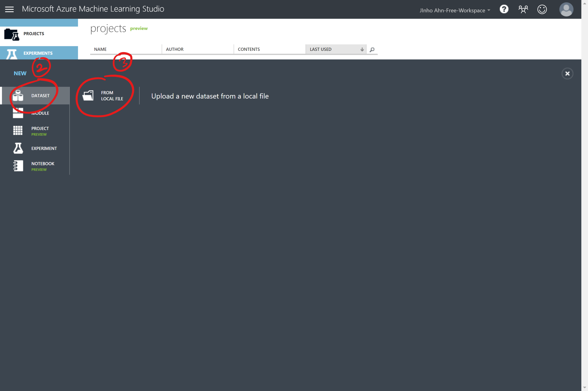
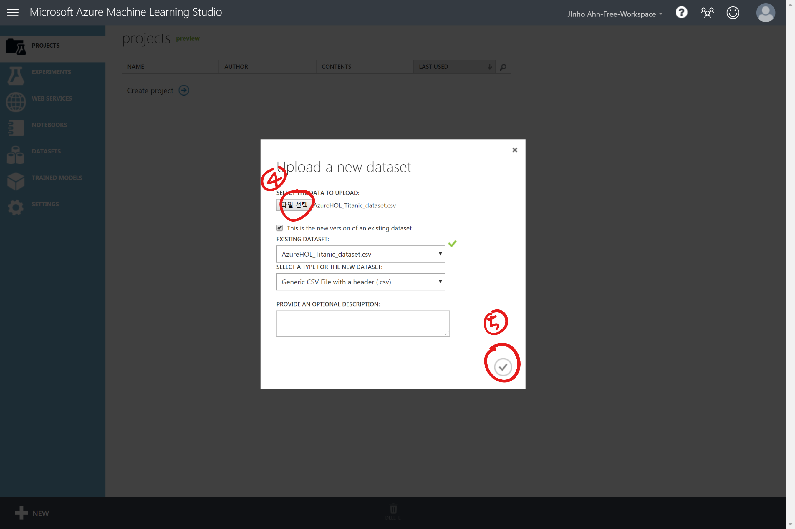
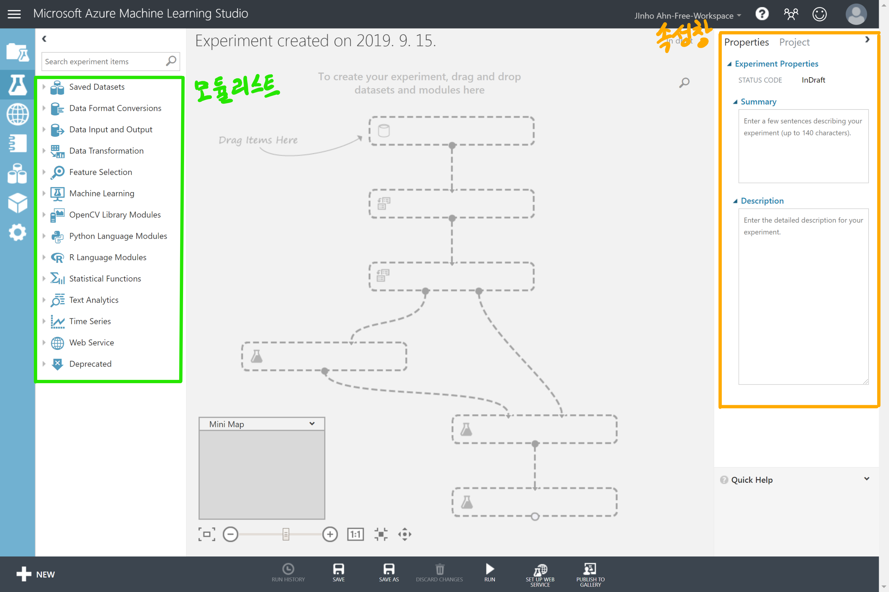
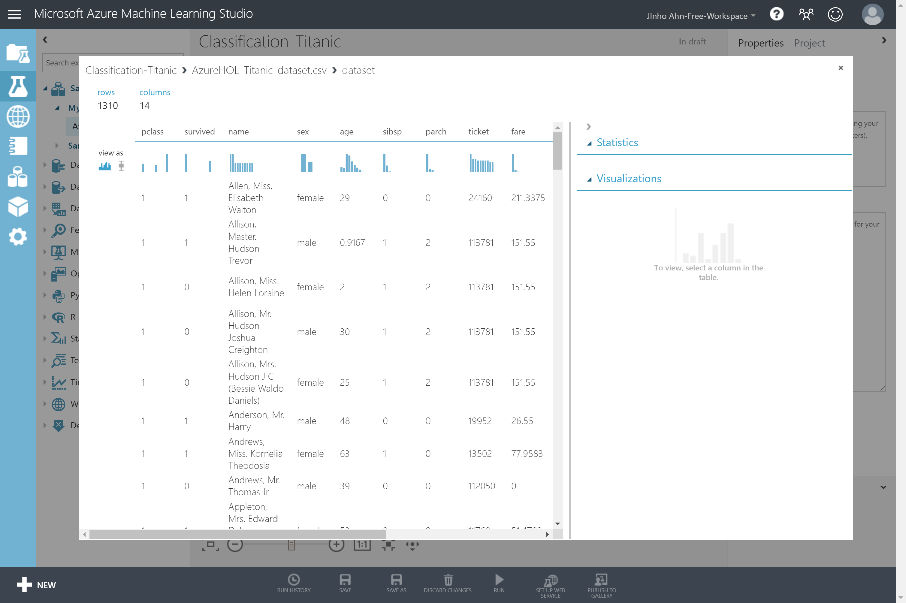
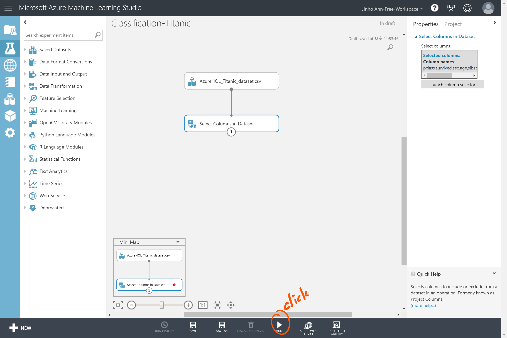
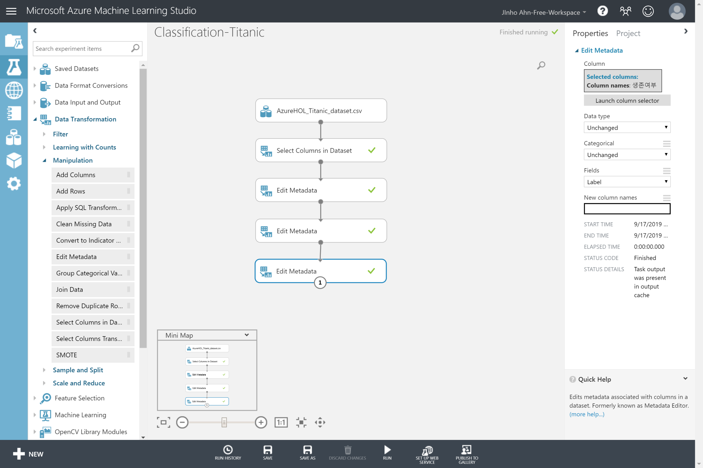

# DAY 2

> 강사: Keras Korea 전미정 / 안드로이드 개발자 (Blink, BFT, BBL, maptales)

- 코드없이 만드는 머신러닝

- Classification 모델 생성


## Azure ML Studio 소개

### Azure란

- 마이크로소프트에서 제공하는 클라우드 서비스


### Azure AI Service

- Machine Learning
  - custom model 생성
- Cognitive Service
  - microsoft model 활용


### Azure Machine Learning Studio

- Visual Interface
- Drag & Drop
- No Terminal
- No code
- R, Python, SQL
- tensorflow


### 머신러닝 과정

1. 문제정의
2. 데이터 셋 준비
3. 모델 설정
4. 모델 훈련 / 평가
5. 모델 활용

Azure에서는 문제정의를 제외한 단계에서 총 111개 모듈을 사용 가능


## Azure Machine Learning Studio

https://studio.azureml.net (마이크로소프트 계정 필요)

타이타닉 탑승객 생존 여부 예측 예제 실습

- 데이터 전처리
- 모델 학습 / 예측


### 데이터 전처리

#### 데이터셋 업로드







#### 데이터 지원 형식

- 헤더가 있거나(.csv) 없는(.nh.csv) 쉼표로 구분된 값(CSV)
- 헤더가 있거나(.tsv) 없는(.nh.tsv) 탭으로 구분된 값(TSV)
- 일반 텍스트(.txt)
- Excel 파일, Azure 테이블, Hive 테이블
- SQL 데이터베이스 테이블
- SVMLight 데이터(.svmlight)
- 특성 관계 파일 형식(ARFF) 데이터(.arff)
- Zip 파일(.zip)
- R 개체 또는 작업 영역 파일(.RData)


#### 데이터 지원 유형

- 문자열
- 정수
- double
- BOOLEAN
- Datatime
- timespan


#### Experiment 만들기


#### Module list, Properties




#### 데이터 로딩


#### 데이터 탐색





#### 열 선택


사용할 feature와 label만 남긴다.





#### 열 이름 변경

1. `Module list` → `Data Transformation` → `Manipulation` → `Edit Metadata`
2. `Edit Metadata` 모듈을 `Select Columns in Dataset` 모듈과 연결 
3. `Properties` → `Launch column selector` → 모든 columns 선택
4. `Properties` → `New column names` → 열 순서대로 변경할 이름을 `,`로 구분하여 입력

| 기존 열 이름 | 변경된 열 이름 |
| :----------: | :------------: |
|    pclass    |    선실등급    |
|   survived   |    생존여부    |
|     sex      |      성별      |
|     age      |      나이      |
|    sibsp     |   형제배우자   |
|    parch     |    부모자식    |
|     fare     |      요금      |
|   embarked   |     출항지     |

5. `run`


항상 `run` 이후에는 모듈 노드 최하단에 있는 점을 우클릭하여 `visualize`를 확인해 보는 것이 좋다.


#### 범주형 변수 선언

1. 새로운 `Edit Metadata` 모듈 연결
2. `Properties` → `Launch column selector` → *선실등급*, *생존여부*, *성별*, *출항지* 선택
3. `Properties` → `Categorical` → `Make categorical`
4. `run`


#### Label 선언

1. 새로운 `Edit Metadata` 모듈 연결
2. `Properties` → `Launch column selector` → *생존여부* 선택
3. `Properties` → `Fields` → `Label`
4. `run`




#### Label data type 선언

1. 새로운 `Edit Metadata` 모듈 연결
2. `Properties` → `Launch column selector` → *생존여부* 선택
3. `Properties` → `Data type` → `Boolean`
4. `run`


#### Missing Data 처리

1. `Module list` → `Data Transformation` → `Manipulation` → `Clean Missing Data`
2. `Clean Missing Data` 모듈을 직전 모듈과 연결
3. `Properties` → `Launch column selector` → *나이* 선택
4. `Properties` → `Cleaning mode` → `Replace with mean` (missing value를 평균값으로 대체)
5. `run`
6. 새로운 `Clean Missing Data` 모듈을 직전 모듈 하단 왼쪽 포인트와 연결
7. `Properties` → `Selected columns`가 기본값인 All columns로 설정되어있음
8. `Properties` → `Cleaning mode` → `Remove entire row` (missing value를 가진 행을 삭제)
9. `run`


#### 데이터셋 분리

1. `Module list` → `Data Transformation` → `Sample and Split` → `Split Data`

2. `Split Data` 모듈을 직전 모듈 하단 왼쪽 포인트와 연결

3. `Properties` → `Splitting mode` → `Split Rows` (default)

4. `Properties` → `Fraction of rows in the first output dataset` → 0.8 (train dataset 비율, test dataset 비율은 0.2가 됨)

5. `Properties` → `Random seed` → 0보다 큰 정수 아무거나 입력

   > Random seed를 설정하는 이유: 여러 종류의 모델을 실험할 때 데이터를 랜덤하게 선택해서 결과가 바뀌는 상황을 방지하기 위해서이다.

6. `Properties` → `Stratified split` → `True` → `Launch column selector` → *성별* 선택

   > Normal split
   >
   > ```
   > 구성원 전체 N명 중 n명 분리
   > ex) 1/2로 나눈다면
   > AAAABB → AAA / ABB or AAB / AAB
   > ```
   >
   > Stratified split
   >
   > ```
   > 같은 비율로 A와 B에서 따로 분리
   > ex) 1/2로 나눈다면
   > AAAA BB → AA / AA, B / B → AAB / AAB
   > ```

7. `run`


### 모델 학습 / 예측

#### 모델의 종류

- Supervised Learning
  - Classification
  - Regression
  - Anomally detection
- Unsupervised Learnin
  - Clustering
- Reinforcement Learning


#### 모델 선정 기준

- Accuracy
  - 어느정도의 정확도 품질을 요구하는지
- Parameter
  - 조정할 수 있는 파라미터(하이퍼 파라미터)가 무엇인지
- Training Time
  - 훈련 시간이 길어도 되는지 짧아야 되는지
- Feature
  - Feature 수가 많은지 적은지
- Linearity
  - 선형 모형인지
- etc.

> 알고리즘 치트 시트 참고
>
> https://docs.microsoft.com/ko-kr/azure/machine-learning/studio/algorithm-cheat-sheet


#### 모델 선택

1. `Module list` → `Machine Learning` → `Initialize Model` → `Classification` → 이진 분류 모형 선택 (여기서는 `Two-Class Average Perceptron`을 사용했음)
2. `Properties` → 알맞게 설정 (여기서는 `Learning rate`을 0.1로 설정하고 다른 설정은 기본값으로 둠)

|    Classification Model     | <center>특징</center>                                        |
| :-------------------------: | :----------------------------------------------------------- |
|     Average Perceptron      | 데이터셋이 간단한 경우<br/>정확도 < 속도                     |
|     Bayes Point Machine     | 오버피팅이 우려되는 경우<br/>간단한 셋팅                     |
|    Boosted Decision Tree    | 높은 정확도가 필요한 경우<br/>메모리 사용률 높음             |
|       Decision Forest       | 앙상블 모델에 적합<br/>효율적인 메모리 사용                  |
|       Decision Jungle       | 뛰어난 일반화 성능<br/>효율적인 메모리 사용<br/>다소 긴 훈련 시간 |
| SVM(Support Vector Machine) | Feature가 많은 경우<br/>속도 > 정확도                        |
|      Locally Deep SVM       | Feature가 많은 경우<br/>SVM 보다 빠른 속도<br/>적은 모델 용량 |
|     Logistic REgression     | 통계적 접근법<br/>숫자 변수 활용                             |
|       Neural Network        | 인공신경망 레이어<br/>다양한 parameter 조절이 가능           |


#### 모델 학습

1. `Module list` → `Machine Learning` → `Train` → `Train Model`
2. `Train Model` 모듈의 상단 왼쪽 포인트를 모델 모듈(`Two-Class Average Perception`)과 연결
3. `Train Model` 모듈의 상단 오른쪽 포인트를 `Split Data` 모듈 하단 왼쪽 포인트와 연결
4. `Properties` → `Label column` → `Launch column selector` → *생존여부* 선택
5. `run`


#### Test Data 예측

1. `Module list` → `Machine Learning` → `Score` → `Score Model`
2. `Score Model` 상단 왼쪽 포인트를 `Train Model` 모듈과 연결
3. `Score Model` 상단 오른쪽 포인트를 `Split Data` 하단 오른쪽 포인트와 연결
4. `run`


#### 모델 평가

1. `Module list` → `Machine Learning` → `Evaluate` → `Evaluate Model`
2. `Evaluate Model` 모듈 상단 왼쪽 포인트를 `Score Model` 모듈과 연결
3. `run`


> Accuracy: 전체중에 얼마나 맞췄는가?
>
> Precision: 예측한 True 중에 실제 True가 얼마인가? (실제 False가 True로 예측되면 좋지 않은 경우 (ex. Spam 메일 추출) 이 척도를 본다.)
>
> Recall: 실제값이 True인데 예측은 얼마나 맞췄는가? (True가 정말 중요한 경우 (ex. 암세포 진단) 이 척도를 본다.)
>
> F1 Score: Precision과 Recall을 적절하게 섞은 척도

