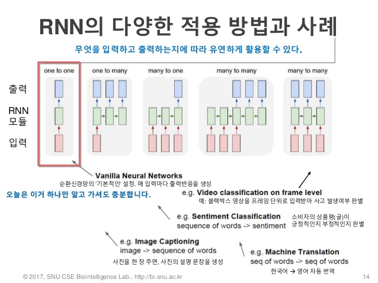

# DAY 3

> 강사: 이상훈

### 딥러닝 이야기:

#### 딥러닝 학습원리 및 환경

Contents

- Machine Learning Pipeline
- Neural Network 기본 원리
- Deep Neural Network로의 발전
- 딥러닝을 위한 환경


## Machine Learning Pipeline

- Data acquisition and understanding
  - Problem Definition
  - Data Collection
- Modeling
  - Feature Engineering
  - Model Selection
  - Optimization
  - Evaluation
- Deployment
  - Containers
  - Reporting
  - Applications
  - Databases


### Feature Engineering

<center>
    <b>비정제 데이터</b>: 비정제 데이터는 피쳐 벡터 형태로 구성되어 있지 않다.<br/>
    ↓<br/>
    <b>피쳐 추출</b><br/>
    ↓<br/>
    <b>피쳐 벡터</b>: 비정제 데이터에서 피쳐를 생성하는 과정을 피쳐 추출이라 함.
</center>

예시)

```json
house_info : {
	num_rooms: 6
	num_bedrooms: 3
	street_name: "Shorebird Way"
	num_basement_rooms: -1
	...
}
```

이러한 Json 형식 데이터에서 street_name 피쳐를 추출하여 컴퓨터로 처리할 수 있도록 one-hot encoding 할 수 있음

```
street_name 피쳐 =
[0, 0, ..., 0, 1, 0, ..., 0]
V 크기는 고유한 거리 이름 수
```


#### Feature Engineering 시 고민해야 할 부분

- 데이터의 표현 방식
  - 스칼라, 벡터, Space 등
- 데이터 변환
  - 연속형? 범주형?
  - 바이너리?
  - Binning?
- 텍스트, 이미지, 음성 등
- one-hot encoding, digit recognition


### Model Selection

예측모델이 실제 현상을 Underfitting 또는 Overfitting하지 않도록 고려하여 모델을 선택해야 한다.


#### Evaluation을 더 잘하기 위한 방법

데이터를 train data와 validation data, test data로 split 하여 사용

- train data를 이용하여 모델 학습
- validation data를 이용하여 hyperparameters 결정
- test data를 이용하여 모델 평가


## Neural Network 기본 원리

### Single Layer Perceptron


$$
y=
\begin{cases}
0,&\text{if}\quad x_1w_1+x_2w_2+\dots\leθ
\\
1,&\text{otherwise}
\end{cases}
$$

```
x: 입력 신호 (input)
y: 출력 신호 (output)
w: 가중치. 입력 신호별 고유의 가중치를 가진다.
θ: 임계치(값). 뉴런을 활성화 시키는 한계
```


Single Layer Perceptron은 XOR과 같은 문제를 풀 수 없다는 한계가 있다.


### Multi Layer Perceptron


Digit Recognition의 경우

- 784 Inputs
- $u_j=\sum w_{ij}x_i$
- $u'_k=\sum w'_{jk}u_j$
- 10 Outputs


### Propagation

- Forward propagation
  - input training data로부터 output을 계산하고, 각 output neuron에서의 error를 계산
- Back propagation
  - output neuron에서 계산된 error를 각 edge들의 weight를 사용해 바로 이전 layer의 neuron들이 얼마나 error에 영향을 미쳤는지 계산

참고: http://sanghyukchun.github.io/74/

Neural Network의 형태에 따라 학습과정을 살펴볼 수 있는 사이트:
http://playground.tensorflow.org


### Gradient Descent (GD)

#### Gradient

- 가장 적합한 모델은 오류를 최소화 하는 likelihood를 최대화 하는 것이다.

- Gradient란 함수가 가장 빠르게 증가할 수 있는 방향을 의미(편미분, 점 (x, f(x))에서 함수와 접하는 선의 기울기)

- F가 단변수 함수인 경우, 점 x에서의 미분값은 x가 아주 조금 변했을 떄 f(x)의 변화량을 의미

  ```
  def difference_quotient(f, x, h):
  	return (f(x + h) - f(x)) / h
  ```


#### Step size(learning rate)

- 한번 학습할 때 해가 이동하는 거리에 대한 비율
- 시간에 따라 이동거리 줄임
- 이동할 때마다 목적함수를 최소화


#### Optimization

- Local minimum에 빠지지 않고 global minimum에 도달할 수 있도록 gradient descent algorithm을 선택하고 learning rate를 조절해야 한다.
- gradient descent algorithm의 종류
  - SGD
  - Mumentum
  - AdaGrad
  - Adam
  - ...
- 좋은 learning rate는 예측 오류가 점점 줄어드는 형태를 보인다.


### Activation Function


선형성에 비선형성을 가미하는 함수

- Sigmoid
- Hyperbolic Tangent (tanh)
- Rectified Linear Unit (relu)
- Leaky Relu
- Parametric Relu
- ...


#### Sigmoid
- Nonlinear를 추가해서 모델을 복잡하게 만들기
- Gradient vanishing
- Not zero-centered → 지그재그 문제


#### Hpyerbolic Tangent (tanh)
- Gradient vanishing
- Not zero-centered → 지그재그 문제


#### Rectified Linear Unit (relu)
- sigmoid나 tanh 함수와 비교했을때 SGD의 수렴속도가 매우 빠름
- piece-wise linear
- 계산이 간단함
- 단, Dead 뉴런 발생 가능성 존재 (활성화되지 않은 값은 무조건 0)


#### Leaky Relu와 Parametric Relu (p-relu)
- 기존 relu를 보완
- 마이너스 값도 약간 활용됨


### Weight Initialization

초기 가중치를 어떻게 주느냐에 따라 결과가 달라지기도 한다.

- 모든 가중치를 0으로 초기화
  - 선형모데롭다 좋지 않을 수 있다.
- 무작위로 가중치 초기화
  - 값이 사라지거나 폭발하는 두 가지 문제가 발생할 수 있다.
- Xavier, He Initialization 사용
  - w = np.random.randn(n_input, n_output) / sqrt(n_input/2)


### DropOut

Regularization의 일종으로 hidden node를 모두 훈련시키지 않고 랜덤하게 drop out 시킨다.

drop out된 node와 관련된 weight들은 모두 훈련되지 않는다.


### DropBlock

CNN에서 랜덤하게 drop out 시키는 것은 큰 의미가 없을 수 있다.

인접한 영역을 drop 시키는 방법


### ResNet (Residual Networks)

Networks의 depth가 늘어난다고 무조건 성능이 좋아지지는 않는다. (degration 문제(gradient vanishing /exploding) )

residual(잔차)를 학습시켜 더 깊은 networks를 이전보다 더 쉽게 학습시키도록 만드는 방법


### Confusion Matrix

모델의 성능을 평가하기 위한 지표로 사용된다.


### Hyper-parameter tuning

하이퍼파라미터는 모델의 파라미터를 측정하기 위해 알고리즘 구현 과정에서 사용되는 변수이다.

딥러닝 모델의 경우 학습률, 미니배치 크기, L2 정규화 계수 등이 있다.

대표적인 하이퍼파라미터 튜닝 방법: Grid Search, Random Search


- 그리드 탐색 (Grid Search)
  - 모델에 적용하고 싶은 하이퍼파라미터 값을 미리 정해두고 하나씩 적용해보며 모델의 성능이 더 좋은 하이퍼파라미터를 찾아가는 방법
  - scikit-learn의 GridSearchCV 이용
- 랜덤 탐색 (Random Search)
  - 지정된 범위 내에서 하이퍼파라미터 값을 임의로 적용하면서 모델의 성능이 더 좋은 하이퍼파라미터 값을 찾아가는 방법
  - scikit-learn의 RandomizedSearchCV 이용
- Baysian Optimization
  - $f(x)$의 형태를 명확하게 알 수 없으면서 계산하는데 오랜 시간이 소요되는 경우, 가능한 적은 수의 후보 $x$값에 대해서 $f(x)$를 순차적으로 조사하면서 최적해 $x$를 찾아가는 방법
  - 하이퍼파라미터 튜닝에 적용한다면 $x$는 하이퍼파라미터, $f(x)$는 모델의 성능 (accuracy, precision, ...)
  - [참고](http://research.sualab.com/introduction/practice/2019/02/19/bayesian-optimization-overview-1.html)
- 앙상블 학습 (Encemble learning)
  - 좋은 성능의 모델 여러개를 연결하는 방법
  - 최상의 단일 모델보다 좋은 성능을 보이는 경우가 많다.


### 인공신경망 학습 레시피

https://karpathy.github.io/2019/04/25/recipe/

번역글: https://bit.ly/2vlTtWu


## Deep Neural Network로의 발전

### Convolution Neural Network

- Digit Recognition 문제에서 완전연결 계층(fully connected layer)을 이용하려면 3차원 데이터를 1차원 데이터로 풀어야 한다.

  - 이러한 방법은 **데이터의 형상이 무시**되어 이미지의 위치, 크기, 각도, 조명 변화 등에 취약하다.

- 방법
  
  1. 동일한 이미지를 이동, 왜곡, 반전, 필터 적용 등으로 임의로 변형시켜 데이터를 부풀려 사용
  2. 입력 데이터의 형상을 유지할 수 있는 합성곱층(Convolution Layer) 이용
  
  

참고: https://excelsior-cjh.tistory.com/180


### Recurrent Neural Network

- 시계열 데이터 인식 및 예측에 사용된다.

  - 음성인식, 번역, 자율주행, 전력 예측 등

- 모든 입력과 출력이 각각 독립적인 것이 아니라 순차적으로 처리된다고 가정

- 관심있는 시퀀스 정보가 5개의 단어로 이루어진 문장이라면, RNN 네트워크는 단어당 하나의 레이어씩 5-layer 신경망 구조로 펼쳐진다.

  


#### Character-level language model example


참고: http://karpathy.github.io/2015/05/21/rnn-effectiveness/


#### RNN의 형태와 사례




#### RNN 발전버전

- Bidirectional RNN

  

- Deep Bidirectional RNN

  

  참고: https://buomsoo-kim.github.io/keras/2019/07/29/Easy-deep-learning-with-Keras-20.md/


#### LSTM

- 장기 의존성 문제 (long-term dependency)

  - e.g. "나는 프랑스에서 자랐습니다. (...) 나는 ???어를 잘합니다."
  - (...) 이 부분이 늘어날 수록 ???을 예측하기 어려워진다.

- LSTM은 이러한 장기 의존성 문제를 어느정도 해소 가능

  

참고: https://firmcode.tistory.com/15


## 딥러닝을 위한 환경

### Deep Learning Framework

#### Tensorflow

- History
  - 구글 내부에서 사용하던 프레임워크를 고도화하여 오픈소스화
  - 2015년 11월 첫 릴리즈
  - 구글 서비스 및 프로젝트에 범용적으로 사용 중
- 장점
  - 연구뿐만 아니라 실무에서도 활발하게 사용되어 가장 두터운 사용자 층을 가지고 있다.
  - Tensorboard
- 단점
  - 상대적으로 속도가 느리다.
  - 버전에 따른 API 변화가 심하고 API 정리가 필요
    - Tensorflow 2.0에서 큰 변화중


#### Pytorch

- History
  - Facebook에서 주로 개발됨
  - 2017년 10월 첫 릴리즈
  - Torch를 Python 버전으로 새로 개발
- 장점
  - 최근 연구는 Pytorch가 조금 더 많은 편
  - 코드가 간결한 편
- 단점
  - Tensorflow에 비해 사용자 층이 협소한 편
  - 보통 스스로 학습 코드를 작성해야 한다.


#### Keras

- History
  - Francois Chollet이라는 구글 직원이 theano의 high-level 인터페이스를 위해 개발 ('15 3월)
  - 이후 Tensorflow가 출시되어 Tensorflow도 지원 (2.0에는 Tensorflow 내부에 내장)
- 장점
  - 코딩이 매우 단순하고 Pretrained model 등을 지원
  - 빠르게 모델링하여 시행착오를 줄일 수 있다.
  - Caffe, torch, tensorflow 모델 import 가능
- 단점
  - High-level 인터페이스이기 때문에 디테일한 작업은 어렵다.
  - 상대적으로 최신버전 사용이 어렵다.


### 딥러닝 환경 구성방안

#### 개인 스터디용 환경

1. 윈도우 데스크탑 + VMware or Virtual Box
2. 리눅스 데스크탑
   - GTX-1060 or GTX-1080Ti
3. Cloud 서비스 이용
   - Amazon, Google, MS 등
   - 무료 크래딧 최대한 활용
   - 편리하지만 데스크탑보다 비쌀 수 있음
4. Google Colab
   - 실습: https://colab.research.google.com/notebooks/welcome.ipynb?hl=ko
   - Google Drive 연동을 해놓지 않으면 데이터가 날아갈 수 있으니 주의
5. 추가적인 환경 및 기타
   - JupyterLab, Anaconda +
   - Docker

