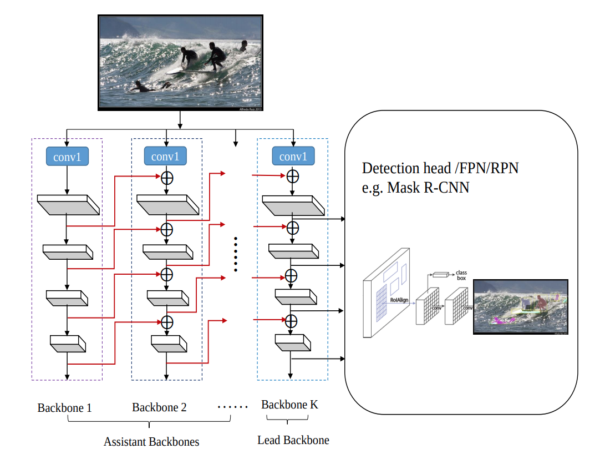
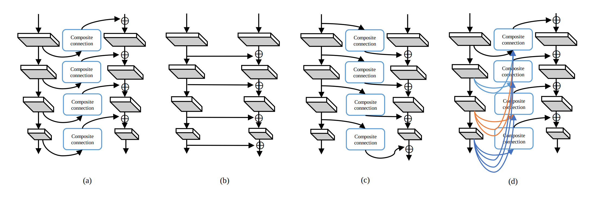

# CBNet: A Novel Composite Backbone Network Architecture for Object Detection

paper: https://arxiv.org/abs/1909.03625v1

code: https://github.com/PKUbahuangliuhe/CBNet

## 1 Introduction

## 2 Related work

## 3 Proposed method

### 3.1 Architecture of CBNet

- CBNet은 K개의 backbone으로 구성

- K=2이면 Dual-Backbone (DB), K=3이면 Triple-Backbone (TB)

- K번째 Backbone은 Leader Backbone이고 1~K-1번째 Backbone은 Assistant Backbones

- 각 Backbone은 L개의 stage로 구성 (일반적으로 L=5)

- 각 stage는 같은 사이즈의 feature map을 갖는 여러개의 convolutional layers로 구성

- L번째 stage는 비선형 변환 $F^l(\cdot)$

  - Backbone이 한개인 경우:

    $$x^l = F^l(x^{l-1}),\quad l \geq 2$$

    $x^l$은 $l$번째 stage output

  - Backbone이 여러개인 경우(CBNet architecture):

    $$x^l_k = F^l_k ( x^{l-1}_k + g(x^l_{k-1})),\quad l \geq 2$$

    $g(\cdot)$은 $1\times 1$ convolutional layer와 batch normalization layer로 구성되어 채널 축소 및 upsampling 동작 수행 (Composite connection)

  - $B_{k-1}$의 $l$번째 stage output features는 $g(\cdot)$에 의해 변환되어 $B_k$의 $l$번째 stage input으로 쓰임

  - 이러한 composition을 Adjacent Higher-Level Composition (AHLC) 라고 부름

- For object detection task,

  - Lead Backbone ($x^l_K(l=2,3,...,L)$) 이 RPN/detection head의 input으로 쓰임
  - Assistant Backbone의 각 stage output은 이웃한 Backbone으로 전달

- CBNet의 Assistant Backbone은 다양한 backbone architecture를 적용할 수 있음 (e.g. ResNeXt), 또한 미리 학습된 single backbone 모델로 초기화할 수 있음

### 3.2 Other possible composite styles

    
     (a) AHLC, (b) SLC, (c) ALLC, (d) DHLC

#### Same Level Composition (SLC)

- $$x^l_k=F^l_k(x^{l-1}_k+x^{l-1}_{k-1}),\quad l\geq 2$$

#### Adjacent Lower-Level Composition (ALLC)

- $$x^l_k=F^l_k(x^{l-1}_k+g(x^{l+1}_{k-1})),\quad l\geq 2$$

#### Dense Higher-Level Composition (DHLC)

- $$x^l_k=F^l_k(x^{l-1}_k+\sum_{i=l}^Lg_i(x^i_{k-1})),\quad l\geq 2$$

