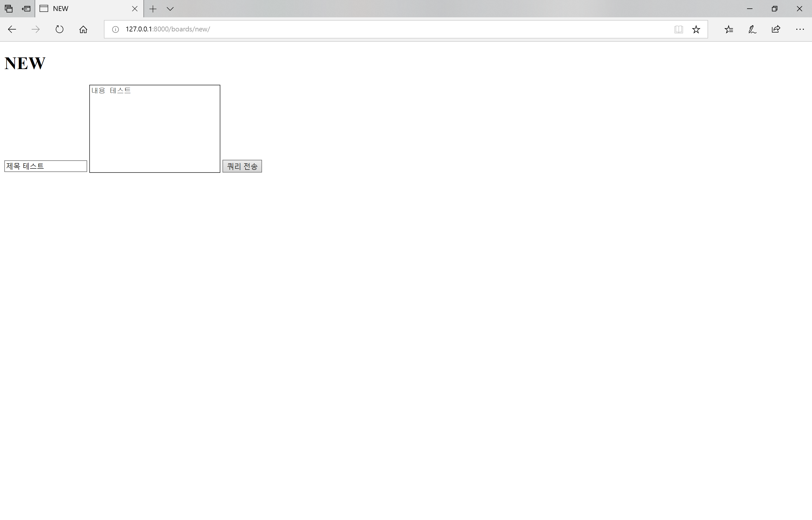
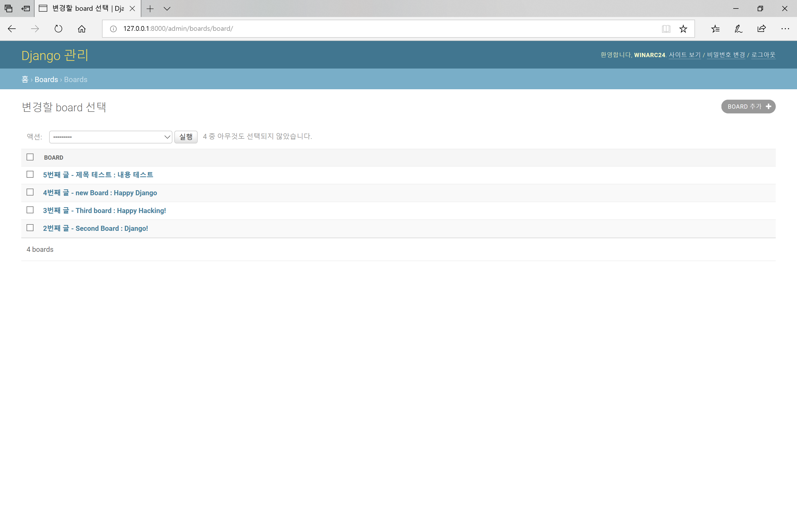

# Django + DB

### Project Setting

> 프로젝트 생성

```bash
$ pip install django
$ django-admin startproject crud .  # django 프로젝트
$ python manage.py startapp boards  # django app
```


> 프로젝트 설정

in `curd/settings.py`

1. Apps 설정

    ```python
    INSTALLED_APPS = [
        'boards.apps.BoardsConfig',  # boards

        'django.contrib.admin',
        'django.contrib.auth',
        'django.contrib.contenttypes',
        'django.contrib.sessions',
        'django.contrib.messages',
        'django.contrib.staticfiles',
    ]
    ```


2. 언어/지역 설정

    ```python
    LANGUAGE_CODE = 'ko-kr'

    TIME_ZONE = 'Asia/Seoul'
    
    USE_TZ = False
    ```


3. DB 설정

    ```python
    DATABASES = {
        'default': {
            'ENGINE': 'django.db.backends.sqlite3',
            # 여러 종류의 DB 를 추가할 수 있다.
            # 'ENGINE': 'django.db.backends.postgresql',
            # 'ENGINE': 'django.db.backends.mysql',
            # 'ENGINE': 'django.db.backends.oracle',
            'NAME': os.path.join(BASE_DIR, 'db.sqlite3'),
        }
    }
    ```


> 모델 작성

in `boards/models.py`

```python
# django 에서 모델을 선언할 때 models.Model 을 상속받는다.
class Board(models.Model):
    # id 는 기본적으로 처음 테이블 생성시 자동으로 만들어진다.
    # id = models.AutoField(primary_key=True)

    # 클래스 변수 => DB 의 필드를 나타냄
    title = models.CharField(max_length=10)  # 문자 10자까지
    content = models.TextField()  # 문자열
    created_at = models.DateTimeField(auto_now_add=True)  # 생성 시점의 시간
    updated_at = models.DateTimeField(auto_now=True)  # 작업 시점의 시간
```


> 모델 생성

django에서 위에 작성한 모델을 사용하겠다고 알려줌

```bash
$ python manage.py makemigrations
```

결과:

```bash
Migrations for 'boards':
  boards\migrations\0001_initial.py
    - Create model Board
```


> DB에 반영

```bash
$ python manage.py migrate
```

boards app만 migrate 하려면

```bash
$ python manage.py migrate boards
```


> DB에 데이터 넣기

- django shell 열기

    ```bash
    $ python manage.py shell
    ```


- Board 객체 열기

    ```python
    >>> from boards.models import Board
    ```


- 모든 쿼리는 objects를 통해 QureySet에 담긴다.

    ```python
    >>> Board.objects.all()
    <QuerySet []>
    ```


- DB에 데이터 넣는 방법
  1. 첫번째 방법

     ```bash
     >>> board = Board()
     >>> board
     <Board: Board object (None)>
     >>> board.title = 'new Board'
     >>> board.content = 'Hello, World'
     >>> board.title
     'new Board'
     >>> board.content
     'Hello, World'
     >>> board.save()
     ```

     ```python
     >>> board
     <Board: Board object (1)>
     >>> board.id
     1
     >>> Board.objects.all()
     <QuerySet [<Board: Board object (1)>]>
     ```
  
     
  
  2. 두번째 방법
  
     ```python
     >>> board = Board(title="Second Board", content="Django!")
     >>> board.title
     'Second Board'
     >>> board.content
     'Django!'
     >>> board.save()
     ```
  
     
  
  3. 세번째 방법
  
     ```python
     >>> Board.objects.create(title="Third board", content="Happy Hacking!")
     <Board: Board object (3)>
     ```
  


- 데이터 들어있는지 확인

    ```python
    >>> board.full_clean()
    ...
    django.core.exceptions.ValidationError: {'content': ['이 필드는 빈 칸으로 둘 수 없습니다.']}
    ```


>  Interpreter 표현 형식 변경

in `boards/models.py` - `class Board(models.Model):`

```python
def __str__(self):
	# 인터프리터에서 어떻게 표현할지
	return f'{self.id}번째 글 - {self.title} : {self.content}'
```


>  반영 확인

shell 다시 열기

```bash
$ python manage.py shell
```

```python
>>> from boards.models import Board
>>> Board.objects.all()
<QuerySet [<Board: 1번째 글 - new Board : Hello, World>, <Board: 2번째 글 - Second Board : Django!>, <Board: 3번째 글 - Third board : Happy Hacking!>]>
```


> admin에 등록하기

- in `boards/admin.py`

    ```python
    from django.contrib import admin
    from .models import Board

    # Register your models here.
    admin.site.register(Board)
    ```


- on `bash`

    ```bash
    $ python manage.py createsuperuser
    사용자 이름 (leave blank to use 'h2oin'): winarc24
    이메일 주소: winarc24@gmail.com
    Password:
    Password (again):
    ```

    ```bash
    Superuser created successfully.
    ```


- 서버 실행

      ```bash
      $ python manage.py runserver
      ```

  

- URL 뒤에 /admin 붙이고 admin page에 접속

  

  

- admin page 화면

  


> SELECT

- SELECT * FROM boards;

  ```python
  >>> from boards.models import Board
  >>> Board.objects.all()
  <QuerySet [<Board: 1번째 글 - new Board : Hello, World>, <Board: 2번째 글 - Second Board : Django!>, <Board: 3번째 글 - Third board : Happy Hacking!>]>
  ```

  

- SELECT * FROM boards WHERE title="new Board";

  ```python
  >>> Board.objects.filter(title="new Board")
  <QuerySet [<Board: 1번째 글 - new Board : Hello, World>]>
  ```

  

- SELECT * FOM boards WHERE title='new Board' LIMIT 1;

  ```python
  >>> Board.objects.create(title="new Board", content="Happy Django")
  <Board: 4번째 글 - new Board : Happy Django>
  >>> Board.objects.filter(title="new Board")
  <QuerySet [<Board: 1번째 글 - new Board : Hello, World>, <Board: 4번째 글 - new Board : Happy Django>]>
  >>> Board.objects.filter(title="new Board").first()
  <Board: 1번째 글 - new Board : Hello, World>
  ```

  

- SELECT * FROM boards WHERE id=1;

  ```bash
  >>> Board.objects.filter(id=1)
  <QuerySet [<Board: 1번째 글 - new Board : Hello, World>]>
  ```

  

  get 메소드는 primary key에만 사용할 수 있음

  ```python
  >>> Board.objects.get(id=1)
  <Board: 1번째 글 - new Board : Hello, World>
  ```

  

  get 은 값이 중복이거나 일치하는 값이 없는 경우 오류 발생

  ```python
  >>> Board.objects.get(title="new Board")
  ...
  boards.models.Board.MultipleObjectsReturned: get() returned more than one Board -- it returned 2!
  ```

  

- SELECT * FROM boards ORDER BY title ASC;

  ```python
  >>> Board.objects.order_by('title').all()
  <QuerySet [<Board: 2번째 글 - Second Board : Django!>, <Board: 3번째 글 - Third board : Happy Hacking!>, <Board: 1번째 글 - new Board : Hello, World>, <Board: 4번째 글 - new Board : Happy Django>]>
  ```

  

- SELECT * FROM boards ORDER BY title DESC;

  ```python
  >>> Board.objects.order_by('-title').all()
  <QuerySet [<Board: 1번째 글 - new Board : Hello, World>, <Board: 4번째 글 - new Board : Happy Django>, <Board: 3번째 글 - Third board : Happy Hacking!>, <Board: 2번째 글 - Seco
  nd Board : Django!>]>
  ```

  

- index로 데이터 가져오기

  ```
  >>> Board.objects.all()
  <QuerySet [<Board: 1번째 글 - new Board : Hello, World>, <Board: 2번째 글 - Second Board
   : Django!>, <Board: 3번째 글 - Third board : Happy Hacking!>, <Board: 4번째 글 - new Board : Happy Django>]>
  >>> board = Board.objects.all()[2]
  >>> board
  <Board: 3번째 글 - Third board : Happy Hacking!>
  >>> boards = Board.objects.all()[1:3]
  >>> boards
  <QuerySet [<Board: 2번째 글 - Second Board : Django!>, <Board: 3번째 글 - Third board : Happy Hacking!>]>
  >>> type(boards)
  <class 'django.db.models.query.QuerySet'>
  ```

  QureySet 은 List 처럼 index 접근 및 list methods 중 일부 사용 가능하나, 실제 list type 은 아니다.

  

- LIKE

  ```python
  >>> Board.objects.filter(content__contains="Happy")
  <QuerySet [<Board: 3번째 글 - Third board : Happy Hacking!>, <Board: 4번째 글 - new Board : Happy Django>]>
  ```

  ```python
  >>> Board.objects.filter(content__startswith="Happy")
  <QuerySet [<Board: 3번째 글 - Third board : Happy Hacking!>, <Board: 4번째 글 - new Board : Happy Django>]>
  ```

  ```python
  >>> Board.objects.filter(content__endswith="!")
  <QuerySet [<Board: 2번째 글 - Second Board : Django!>, <Board: 3번째 글 - Third board : Happy Hacking!>]>
  ```

  

> UPDATE

```python
>>> board = Board.objects.get(pk=1)
>>> board
<Board: 1번째 글 - new Board : Hello, World>
>>> board.title
'new Board'
>>> board.title = 'Old Board'
>>> board.title
'Old Board'
>>> board.save()
>>> board
<Board: 1번째 글 - Old Board : Hello, World>
```


> DELETE

```python
>>> board = Board.objects.get(pk=1)
>>> board
<Board: 1번째 글 - Old Board : Hello, World>
>>> board.delete()
(1, {'boards.Board': 1})
>>> board = Board.objects.get(pk=1)
...
boards.models.Board.DoesNotExist: Board matching query does not exist.
```


> boards urls.py 연결

in `crud/urls.py`

```python
from django.contrib import admin
from django.urls import path, include

urlpatterns = [
    path('boards/', include('boards.urls')),
    path('admin/', admin.site.urls),
]
```


> 페이지에서 DB 안의 데이터 쿼리

- boards app으로 url 경로 설정

  in `crud/urls.py`

  ```python
  from django.contrib import admin
  from django.urls import path, include
  
  urlpatterns = [
      path('boards/', include('boards.urls')),
      path('admin/', admin.site.urls),
  ]
  ```

  

- index 페이지 생성

  1. `boards/urls.py` 생성

     in `boards/urls.py`

     ```python
     from django.urls import path
     from . import views
     
     urlpatterns = [
         path('', views.index),
     ]
     ```

  2. in `boards/views.py`

     ```python
     from django.shortcuts import render
     
     
     # Create your views here.
     def index(request):
         return render(request, 'boards/index.html')
     ```

  3. `boards/templates/boards/index.html` 생성

  4. in `boards/templates/boards/index.html`
  
     ```html
     <!DOCTYPE html>
     <html lang="en">
     <head>
         <meta charset="UTF-8">
         <title>Boards</title>
     </head>
     <body>
         <h1>Welcome to Boards page</h1>
     </body>
     </html>
     ```
  
- 사용자 입력 페이지 생성

  1. in `boards/urls.py`: urlpatterns 리스트에 추가

     ```python
     path('new/', views.new),  # 사용자 입력 페이지
     ```

  2. in `boards/views.py`: 아래 코드 추가

     ```python
     def new(request):
         return render(request, 'boards/new.html')
     ```

  3. `boards/templates/boards/new.html` 생성

  4. in `boards/templates/boards/new.html`

     ```html
     <!DOCTYPE html>
     <html lang="en">
     <head>
         <meta charset="UTF-8">
         <title>NEW</title>
     </head>
     <body>
         <h1>NEW</h1>
         <form action="/boards/create/">
             <input type="text" name="title" />
             <textarea name="content" id="" cols="30" rows="10"></textarea>
             <input type="submit" />
         </form>
     </body>
     </html>
     ```

     

- 데이터 저장 페이지 생성

  1. in `boards/urls.py`: urlpatterns 리스트에 추가

     ```python
     path('create/', views.create),  # 데이터 저장 페이지
     ```

  2. in `boards/views.py`: 아래 코드 추가

     ```python
     from .models import Board
     
     def create(request):
         # new 에서 보낸 데이터를 변수에 담아서 출력!
         title = request.GET.get('title')
         content = request.GET.get('content')
         board = Board()
         board.title = title
         board.content = content
         board.save()
         return render(request, 'boards/create.html')
     ```

  3. `boards/templates/boards/create.html` 생성

  4. in `boards/templates/boards/create.html`

     ```html
     <!DOCTYPE html>
     <html lang="en">
     <head>
         <meta charset="UTF-8">
         <title>Create</title>
     </head>
     <body>
         <h1>성공적으로 글이 작성되었습니다.</h1>
     
     </body>
     </html>
     ```

     

- /boards/new/ 페이지에서 데이터 입력

  

  

- admin 페이지에서 결과 확인

  

